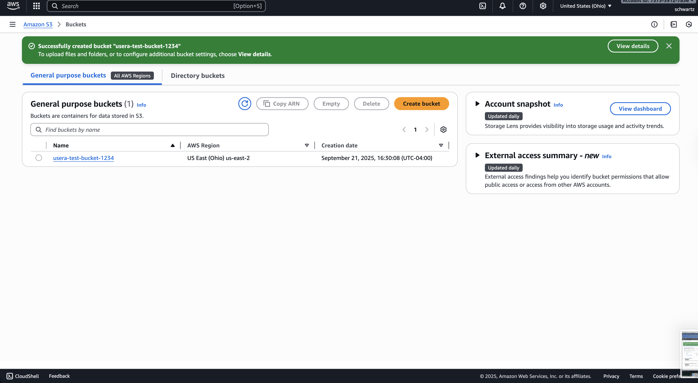
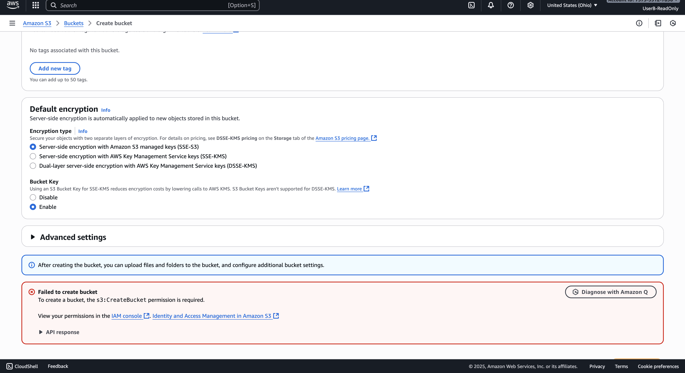

# 🔐 AWS IAM Least Privilege Lab

## 📌 Project Overview
This project demonstrates the **Principle of Least Privilege** in AWS Identity and Access Management (IAM).  
I created two users with different permission levels and tested their ability to create S3 buckets.

- **User A (Admin):** Full AdministratorAccess  
- **User B (ReadOnly):** Restricted ReadOnlyAccess  

Result:  
## 📸 Screenshots

**User A – Bucket Created (Success)**  

**User B was denied ❌**  

---

## 🛠️ Steps Taken
1. Created `UserA-Admin` with **AdministratorAccess**.  
2. Created `UserB-ReadOnly` with **ReadOnlyAccess**.  
3. Tested S3 bucket creation:
   - User A → Success  
   - User B → Denied  
4. Deleted test bucket and both users to keep account secure.  

---

## 📸 Screenshots
- User A creating an S3 bucket (success).  
- User B attempting to create an S3 bucket (Access Denied).  

---

## 🎯 Key Takeaways
- **Least Privilege = More Security.**  
- Over-privileged users increase risk of accidents and insider threats.  
- Best practice: always start with the minimum permissions and add only what’s needed.  

---

## 🚀 Next Steps
- Create custom IAM policies for even more granular access (e.g., S3 GetObject only).  
- Explore AWS Access Analyzer to detect over-privileged users.  
- Extend lab to roles instead of static users.
